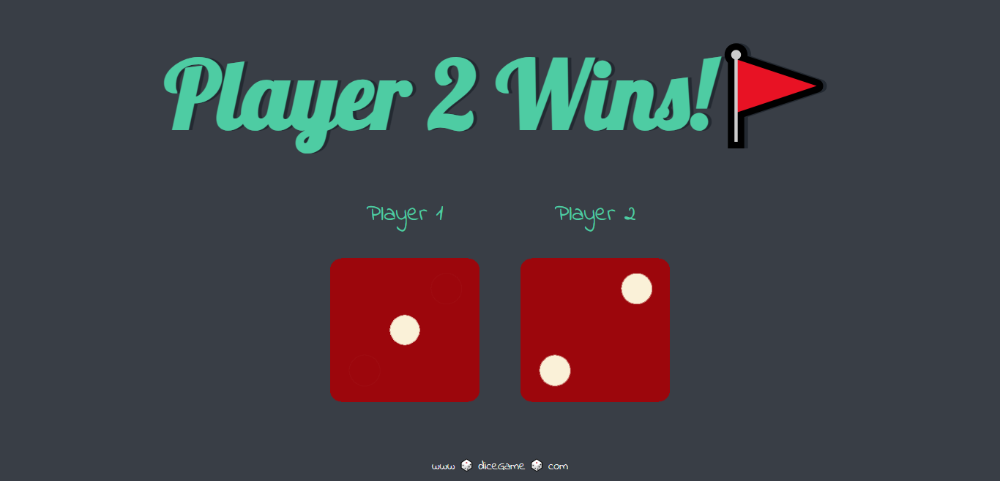

# 🎲 Dice Game – Two Player Dice Roller

This is a fun and interactive two-player dice game built using **HTML, CSS, and JavaScript**.  
Every time the page is refreshed, both players roll a dice and the winner is displayed automatically.

## 🎯 What it includes
- Two player dice rolling system  
- Random number generation (1–6)  
- Dynamic dice image change  
- Winner / Draw result display  
- Clean and simple UI  

## 🛠️ Technologies Used
- HTML5            
- CSS3  
- JavaScript  

## 🎓 Learning Purpose
This project was created as a **self-training project to practice JavaScript DOM manipulation, randomness, and basic game logic**.

## ▶️ How to run
Just open the `dicee.html` file in any modern browser — the game will run instantly.

## 📷 Preview

  
 `

